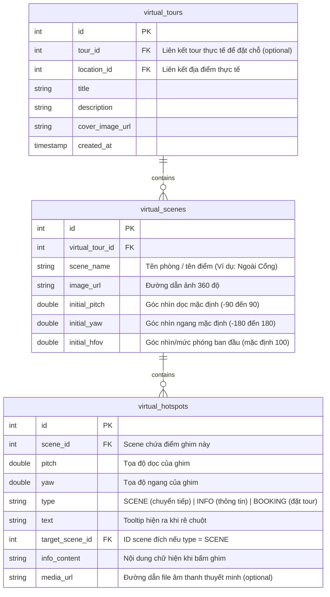

# KẾ HOẠCH PHÁT TRIỂN TÍNH NĂNG VIRTUAL TOUR (DU LỊCH ẢO VR360)
## Giải pháp mở rộng hệ thống Future Travel (Backend & Frontend)

Tính năng **Du lịch ảo VR360 (Virtual Tour)** tương tự như trang của Quảng Trị (`vr360.com.vn`) là một sự nâng cấp đột phá cho website du lịch. Tính năng này cho phép khách hàng tương tác trực quan, xoay 360 độ ngắm cảnh, di chuyển giữa các địa danh qua các điểm tương tác (hotspots) và nghe thuyết minh tự động.

Dưới đây là thiết kế kiến trúc kỹ thuật và kế hoạch tích hợp tính năng này vào hệ thống **Microservices** hiện tại của bạn.

---

## 1. NGUYÊN LÝ HOẠT ĐỘNG CỦA HỆ THỐNG VR360

Hệ thống VR360 trên web bao gồm 3 phần chính:

1.  **Dữ liệu hình ảnh (Equirectangular Panoramas)**:
    *   Là các bức ảnh toàn cảnh 360 độ được chụp bằng camera chuyên dụng (ví dụ: Ricoh Theta, Insta360, GoPro Max) hoặc máy ảnh DSLR lắp ống kính mắt cá (fisheye), sau đó ghép lại bằng phần mềm (như PTGui) theo tỷ lệ **2:1**.
    *   Dữ liệu ảnh này có dung lượng rất lớn (ảnh 8K, 16K khoảng 10MB - 50MB). Chúng ta sẽ lưu trữ chúng trên **Cloudinary** hoặc **Amazon S3** và truyền tải qua CDN để tối ưu tốc độ load.
2.  **Bộ phát và tương tác (Frontend Viewer)**:
    *   Sử dụng thư viện **Pannellum** hoặc **Photo Sphere Viewer** (viết trên nền WebGL và Three.js) để dựng ảnh phẳng 2:1 lên một hình cầu ảo. Trình duyệt sẽ đóng vai trò camera nằm giữa hình cầu đó.
    *   Người dùng có thể kéo chuột để nhìn xung quanh, phóng to/thu nhỏ.
    *   **Hotspots (Điểm tương tác)**: Các điểm ghim nổi trên không gian 360 độ. Khi bấm vào sẽ kích hoạt hành động:
        *   *Chuyển cảnh (Scene Link)*: Dẫn người dùng bước sang không gian khác (VD: đi từ ngoài cổng vào trong chánh điện).
        *   *Xem thông tin (Info)*: Hiện popup văn bản, ảnh cổ, tư liệu lịch sử.
        *   *Nghe thuyết minh (Audio)*: Phát lời kể của hướng dẫn viên ảo cho địa danh đó.
        *   *Đặt tour vật lý (Booking Link)*: Nút "Đặt tour ngay" kết nối trực tiếp đến tour thực tế trên hệ thống.
3.  **Hệ thống Quản trị (VR Builder - CMS)**:
    *   Admin có thể upload các ảnh 360 độ, liên kết các ảnh lại thành một tour du lịch ảo, nhấp chuột lên ảnh để xác định tọa độ (`pitch` - vĩ độ, `yaw` - kinh độ) để đặt ghim hotspots và lưu lại cấu hình xuống Database.

---

## 2. KIẾN TRÚC MỞ RỘNG TRÊN HỆ THỐNG HIỆN TẠI

Hệ thống sẽ được mở rộng trực tiếp trên **`tour-catalog-service`** (Backend) và **`tourism_frontend`** (Frontend) mà không cần tạo mới service khác để tận dụng cơ sở dữ liệu địa danh/tour có sẵn.

```
[React Frontend] (tourism_frontend)
   ├── VRTourList.jsx           (Danh sách các điểm tham quan ảo)
   ├── VRViewerContainer.jsx    (Trình phát VR360 - dùng Pannellum)
   └── AdminVRBuilder.jsx       (Bộ công cụ cho admin tạo Tour/Hotspot)
         │
         │  REST APIs (JSON)
         ▼
[API Gateway :8080]
         │
         ▼
[tour-catalog-service :8081]  (Spring Boot)
   ├── Controller: VirtualTourController.java
   ├── Repository: VirtualTourRepository, VirtualSceneRepository, HotspotRepository
   └── Database: PostgreSQL (Bảng: virtual_tours, virtual_scenes, virtual_hotspots)
```

---

## 3. THIẾT KẾ CƠ SỞ DỮ LIỆU (DATABASE SCHEMA)

Trong cơ sở dữ liệu của `tour-catalog-service` (PostgreSQL), chúng ta thiết kế 3 bảng liên kết:



---

## 4. PHƯƠNG ÁN TRIỂN KHAI CHI TIẾT (IMPLEMENTATION PLAN)

### PHASE 1: Backend API (`tour-catalog-service`)
1.  **Tạo các Entity và Repository**:
    *   Tạo `VirtualTour.java`, `VirtualScene.java`, `VirtualHotspot.java` tương ứng với database schema ở mục 3.
2.  **Xây dựng Controller và Service**:
    *   `GET /api/virtual-tours`: Lấy danh sách điểm du lịch ảo.
    *   `GET /api/virtual-tours/{id}`: Lấy chi tiết cấu hình tour bao gồm danh sách Scenes và các Hotspots đi kèm của từng Scene.
    *   Các API CRUD dành cho Admin: `POST`, `PUT`, `DELETE` các tour, scene, hotspot.
3.  **Tích hợp file upload**:
    *   Đảm bảo cấu hình upload file ảnh hỗ trợ các ảnh dung lượng lớn (tối thiểu 15MB) sang Cloudinary/S3.

### PHASE 2: Tích hợp Viewer trên Frontend (`tourism_frontend`)
1.  **Cài đặt thư viện phát VR360**:
    ```bash
    npm install pannellum-react --save
    ```
2.  **Xây dựng component `VRViewer.jsx`**:
    *   Sử dụng thẻ `<Pannellum>` để hiển thị ảnh 360.
    *   Dùng state trong React để quản lý `currentSceneId`. Khi bấm vào hotspot chuyển cảnh, cập nhật `currentSceneId` để chuyển ảnh mượt mà.
3.  **Xây dựng UI tương tác phụ trợ**:
    *   **Thuyết minh giọng nói (Audio Guide)**: Tự động chạy file ghi âm audio giới thiệu địa danh khi chuyển scene.
    *   **Sơ đồ 2D (Floorplan Map)**: Góc màn hình có sơ đồ điểm di tích. Khi người dùng bấm vào các chấm trên bản đồ sẽ "dịch chuyển tức thời" tới scene 360 tương ứng.
    *   **Chế độ kính VR (VR Cardboard Mode)**: Chia đôi màn hình (Stereoscopic split-screen) sử dụng API Con quay hồi chuyển (Gyroscope) của điện thoại để người dùng lắp điện thoại vào kính thực tế ảo ngắm nhìn.

### PHASE 3: Phát triển Trang Builder dành cho Admin
Để admin không phải cấu hình tọa độ thủ công bằng database (rất khó định vị điểm ghim), ta xây dựng trang **VR Creator**:
1.  Admin upload 360 image -> Hiện ảnh 360 lên viewer.
2.  Bật chế độ **Debug Mode** của Pannellum:
    *   Khi admin nhấp chuột vào bất cứ điểm nào trên ảnh, viewer sẽ trả về tọa độ `pitch` và `yaw` tại console hoặc callback.
3.  Admin điền thông tin hotspot (Ví dụ: chọn loại chuyển cảnh sang scene nào, hoặc gõ thông tin thuyết minh) -> Bấm **[Lưu]** -> Frontend gọi API lưu ghim vào database.

---

## 5. MÔ PHỎNG MÃ NGUỒN FRONTEND (REACT WITH PANNELLUM)

Dưới đây là cấu trúc React component cơ bản để chạy Tour du lịch ảo với nhiều cảnh (Scenes) và các điểm chuyển cảnh (Hotspots):

```jsx
// VRViewer.jsx
import React, { useState, useEffect } from 'react';
import { Pannellum } from 'pannellum-react';
import styles from './VRViewer.module.scss';

const VRViewer = ({ tourId }) => {
  const [tourData, setTourData] = useState(null);
  const [currentScene, setCurrentScene] = useState(null);
  const [loading, setLoading] = useState(true);

  // 1. Tải cấu hình Tour du lịch ảo từ backend
  useEffect(() => {
    fetch(`/api/virtual-tours/${tourId}`)
      .then((res) => res.json())
      .then((data) => {
        setTourData(data);
        // Chọn scene đầu tiên làm điểm xuất phát mặc định
        if (data.scenes && data.scenes.length > 0) {
          setCurrentScene(data.scenes[0]);
        }
        setLoading(false);
      });
  }, [tourId]);

  const handleSceneTransition = (targetSceneId) => {
    const nextScene = tourData.scenes.find(s => s.id === targetSceneId);
    if (nextScene) {
      setCurrentScene(nextScene);
    }
  };

  if (loading) return <div>Đang tải không gian du lịch ảo...</div>;
  if (!currentScene) return <div>Không tìm thấy dữ liệu cảnh 360.</div>;

  return (
    <div className={styles.vrContainer}>
      <h3 className={styles.tourTitle}>{tourData.title} - {currentScene.sceneName}</h3>
      
      <Pannellum
        width="100%"
        height="100vh"
        image={currentScene.imageUrl}
        pitch={currentScene.initialPitch || 0}
        yaw={currentScene.initialYaw || 0}
        hfov={currentScene.initialHfov || 100}
        autoLoad
        showZoomCtrl={true}
        showFullscreenCtrl={true}
      >
        {/* Render danh sách hotspots của scene hiện tại */}
        {currentScene.hotspots && currentScene.hotspots.map((hotspot) => {
          if (hotspot.type === 'SCENE') {
            return (
              <Pannellum.Hotspot
                key={hotspot.id}
                type="custom" // Sử dụng icon mũi tên di chuyển tự định nghĩa
                pitch={hotspot.pitch}
                yaw={hotspot.yaw}
                text={hotspot.text}
                handleClick={() => handleSceneTransition(hotspot.targetSceneId)}
              />
            );
          } else {
            return (
              <Pannellum.Hotspot
                key={hotspot.id}
                type="info"
                pitch={hotspot.pitch}
                yaw={hotspot.yaw}
                text={hotspot.text}
                URL={hotspot.type === 'BOOKING' ? `/tour/booking/${hotspot.tourLinkId}` : undefined}
              />
            );
          }
        })}
      </Pannellum>

      {/* Sơ đồ 2D hoặc danh sách chọn nhanh các phòng (Quick Nav) ở chân trang */}
      <div className={styles.sceneListNav}>
        {tourData.scenes.map((scene) => (
          <button 
            key={scene.id} 
            className={currentScene.id === scene.id ? styles.activeBtn : ''}
            onClick={() => setCurrentScene(scene)}
          >
            {scene.sceneName}
          </button>
        ))}
      </div>
    </div>
  );
};

export default VRViewer;
```

---

## 6. ĐÁNH GIÁ CHUNG VỀ TÍNH KHẢ THI

*   **Tính khả thi: 10/10**. Tính năng này hoàn toàn nằm trong khả năng tích hợp lên hệ thống của bạn. Thư viện `pannellum-react` cực kỳ ổn định, nhẹ và tương thích tốt trên cả Mobile và Desktop.
*   **Trải nghiệm người dùng**: Du lịch ảo giúp nâng tầm sản phẩm. Tại mỗi điểm di tích, việc ghim thêm link đặt tour thực tế (`type = BOOKING`) sẽ chuyển đổi trực tiếp lượng người truy cập du lịch ảo thành khách mua tour thật, tối đa hóa doanh thu cho doanh nghiệp của bạn.
