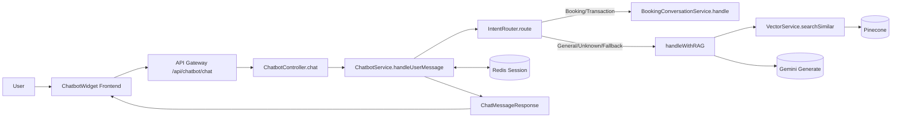
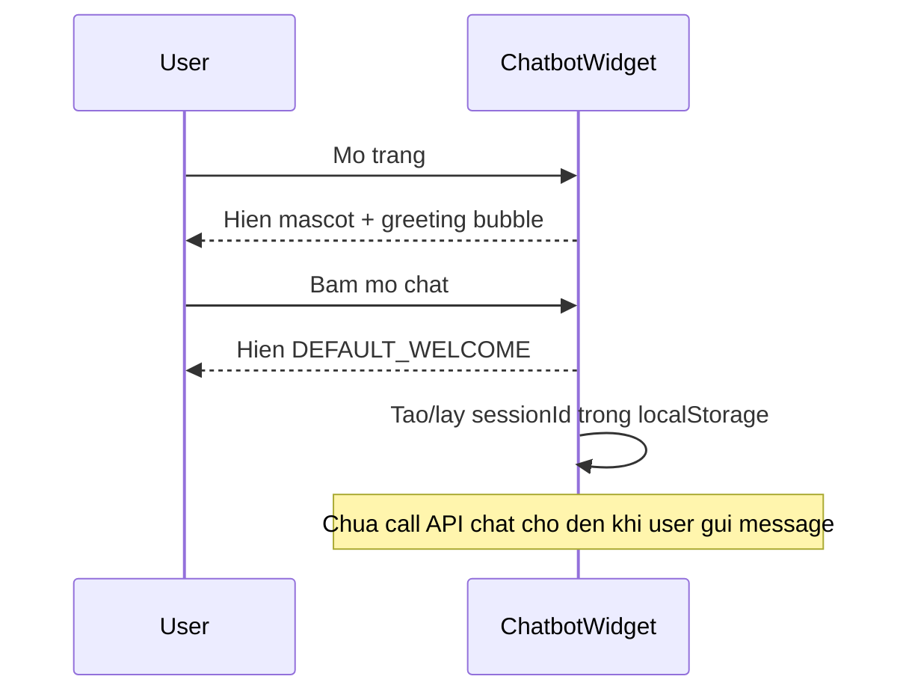
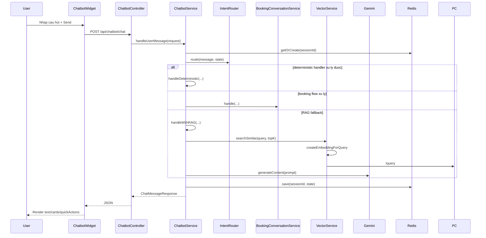
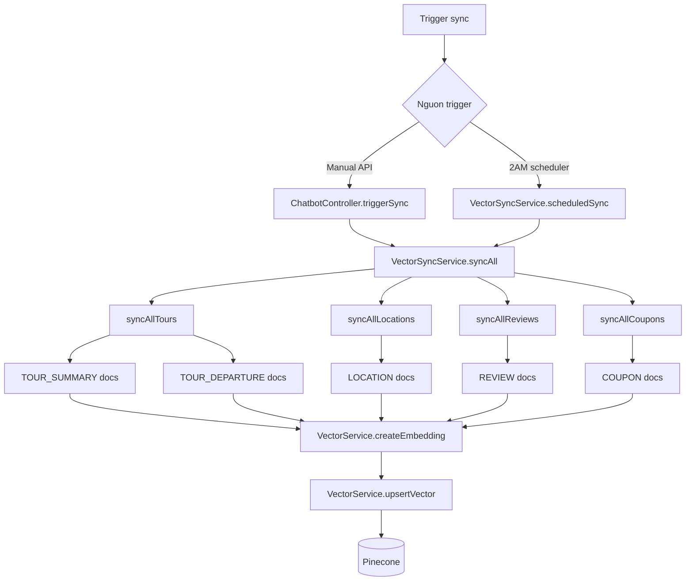

# Chatbot Flow Guide (Runtime Implementation)

## 1) Muc tieu

Tai lieu nay mo ta chinh xac luong chatbot dang chay trong he thong, theo goc nhin implementation:

- User mo chat thi thay gi
- User gui cau hoi thi request di qua class/ham nao
- Khi nao vao nhanh Booking, khi nao vao nhanh RAG
- Luong sync du lieu len Vector DB (Pinecone) chay nhu the nao
- Vi du trace cu the de debug nhanh

Pham vi code duoc tham chieu:

- Frontend widget: `tourism_frontend/client-side/src/components/ChatbotWidget/ChatbotWidget.jsx`
- Chatbot API: `analytics-service` trong microservices backend

---

## 2) Tong quan kien truc

Backend chatbot endpoint:

- `POST /api/chatbot/chat`
- `POST /api/chatbot/admin/sync`
- `DELETE /api/chatbot/admin/clear`
- `GET /api/chatbot/health`

Source: `analytics-service/src/main/java/com/tourism/analytics/controller/ChatbotController.java`.

---

## 3) Luong khi user mo chat

### 3.1 Frontend hien gi truoc khi goi backend

Trong `ChatbotWidget.jsx`:

1. Co bong bong chao xoay vong (`GREETING_MESSAGES`).
2. Khi mo cua so chat, message dau tien la `DEFAULT_WELCOME`.
3. Session ID duoc tao/luu localStorage voi key `chatbot_session_id`.
4. Chua goi backend ngay luc mo chat; chi goi khi user gui tin nhan.

### 3.2 Luong UI

---

## 4) Luong xu ly khi user gui cau hoi

### 4.1 Sequence end-to-end

### 4.2 Ham dieu phoi trung tam

Ham trung tam la:

- `ChatbotService.handleUserMessage(...)`

Thu tu xu ly trong ham nay:

1. Load state session tu Redis
2. Route intent (`IntentRouter.route`)
3. Thu deterministic truoc (`handleDeterministic`)
4. Thu booking flow (`handleBookingFlow`)
5. Neu chua co response -> vao RAG (`handleWithRAG`)
6. Luu lai state vao Redis

---

## 5) Chi tiet nhanh Booking (stateful)

### 5.1 Khi nao vao booking

Booking flow xu ly cac intent nhu:

- `TRANSACTION_FLOW`
- `TOUR_RETRIEVAL` voi task `SEARCH`
- Cac buoc tiep theo trong stage machine (chon tour, chon ngay, hanh khach, lien he, xac nhan)

### 5.2 Luu session state

`RedisSessionService`:

- Key schema: `chatbot:session:{sessionId}`
- TTL: 30 phut

Y nghia:

- Bot nho duoc buoc dang lam do
- Co the `RESUME_BOOKING`
- Co the chen booking context vao prompt khi can

---

## 6) Chi tiet nhanh RAG

### 6.1 Pipeline RAG thuc te

`handleWithRAG(...)` trong `ChatbotService`:

1. Chon `topK` (discount/coupon -> 50, mac dinh -> 10)
2. Goi `vectorService.searchSimilar(userMessage, topK)`
3. Build context (`buildEnhancedContext`)
4. Build prompt co lich su (`buildEnhancedPromptWithHistory`)
5. Goi Gemini (`callGeminiAPI`)
6. Dong goi `ChatMessageResponse` (reply, tourSuggestions, quickActions)

### 6.2 Embedding + Retrieval

`VectorService`:

- Embedding query/doc: Pinecone Inference API (`/embed`)
- Search: Pinecone query endpoint (`/query`)
- Upsert vectors: `/vectors/upsert`

### 6.3 Generation model

Doc cau hinh tai `analytics-service/src/main/resources/application.yml`:

- Generation model: `gemini-flash-latest`
- Embedding model: `llama-text-embed-v2`
- Vector provider: `pinecone`

---

## 7) Luong sync du lieu len Vector DB

### 7.1 Trigger sync

Co 2 cach:

1. Manual: `POST /api/chatbot/admin/sync`
2. Tu dong: scheduler 2:00 AM (`@Scheduled(cron = "0 0 2 * * *")`)

### 7.2 Sequence sync

Loai document duoc sync:

- `TOUR_SUMMARY`
- `TOUR_DEPARTURE`
- `LOCATION`
- `REVIEW`
- `COUPON`

---

## 8) Vi du trace cu the (de debug nhanh)

## 8.1 Vi du A: User hoi "tour nao dang giam gia"

Luong:

1. Frontend send `POST /api/chatbot/chat`
2. `ChatbotService.handleUserMessage`
3. `IntentRouter.route` -> nhan dang discount intent
4. `handleDeterministic` -> `buildDiscountAnswer`
5. `vectorService.searchSimilar(..., 50)`
6. Loc/sap xep tour theo metadata giam gia/coupon
7. Tra reply + quick action + tour cards

Lop/ham chinh:

- `ChatbotService.buildDiscountAnswer(...)`
- `VectorService.searchSimilar(...)`

## 8.2 Vi du B: User hoi "tim tour Da Nang thang 7, 2 nguoi"

Luong:

1. Route ra `TOUR_RETRIEVAL` voi `SEARCH`
2. `handleDeterministic` voi task `SEARCH` -> tra `null` (de booking flow xu ly)
3. `handleBookingFlow` -> goi `BookingConversationService.handle(...)`
4. Session state duoc cap nhat trong Redis
5. Bot hoi tiep thong tin thieu neu can

Lop/ham chinh:

- `ChatbotService.handleBookingFlow(...)`
- `BookingConversationService.handle(...)`
- `RedisSessionService.save(...)`

## 8.3 Vi du C: Admin bam sync du lieu

Luong:

1. Goi `POST /api/chatbot/admin/sync`
2. `ChatbotController.triggerSync()`
3. `VectorSyncService.syncAll()`
4. Lan luot sync tours/locations/reviews/coupons
5. Moi item -> create embedding -> upsert Pinecone

Lop/ham chinh:

- `VectorSyncService.syncAll*`
- `VectorService.createEmbedding(...)`
- `VectorService.upsertVector(...)`

---

## 9) Bang mapping nhanh: intent -> handler

| Nhom intent | Handler chinh |
|---|---|
| GREETING / CANCEL / RESUME / LOOKUP / DISCOUNT / DETAIL / SLOT / PRICE | `ChatbotService.handleDeterministic(...)` |
| TRANSACTION_FLOW / TOUR_RETRIEVAL(SEARCH) / stage dang booking | `ChatbotService.handleBookingFlow(...)` -> `BookingConversationService.handle(...)` |
| GENERAL_RAG / UNKNOWN / fallback | `ChatbotService.handleWithRAG(...)` |

---

## 10) Checklist verify nhanh trong local

1. Mo homepage, mo widget, xac nhan co `DEFAULT_WELCOME`.
2. Gui 1 cau hoi bat ky, xac nhan frontend goi `POST /api/chatbot/chat`.
3. Thu cau hoi giam gia, xac nhan co quick action/card neu co du lieu.
4. Thu cau hoi tim tour theo nhu cau, xac nhan bot vao luong booking stateful.
5. Trigger `POST /api/chatbot/admin/sync`, xem log sync va so docs upsert.

---

## 11) Ghi chu quan trong

- Luong nay phan tich theo runtime implementation hien tai trong code.
- Tai lieu ke hoach (plan/report) co the mo ta cac phase nang cap tuong lai, nhung tai lieu nay uu tien hanh vi dang chay thuc te.
